## 什么是 LLM？和普通程序有什么不同？

先从你熟悉的东西说起。


### 🖥️ 普通程序：人告诉它怎么做

普通程序就像一本"菜谱"。程序员写好每一步规则，电脑严格按菜谱执行：

```python
# 普通程序的样子
def 判断情绪(句子):
    if "开心" in 句子 or "高兴" in 句子:
        return "正面"
    elif "难过" in 句子 or "伤心" in 句子:
        return "负面"
    else:
        return "不知道"
```

这个程序很脆弱——用户说"今天真棒"，它就懵了，因为"棒"不在规则里。**语言太复杂，人根本写不完所有规则。**

---

### 🧠 LLM：自己从数据里学规则

LLM 反过来：**不给它规则，给它海量例子，让它自己归纳规律。**

训练过程只做一件事——反复猜下一个词，猜错了就调整内部参数，猜对了就保留：

```
训练数据：互联网上的数万亿个词

"今天天气真___"  → 模型猜"好" → 对了 ✅ → 参数小幅强化
"苹果是一种___"  → 模型猜"车" → 错了 ❌ → 参数小幅修正
"他学习非常___"  → 模型猜"努力" → 对了 ✅ → 参数小幅强化
                          ↓
              重复几千亿次之后...
                          ↓
              模型学会了语言的统计规律
```

训练结束后，模型里有**数十亿个数字（参数/权重）**，这些数字就是它"学到的知识"的存储形式。

---

### 🔑 最核心的区别

|            | 普通程序           | LLM              |
| ---------- | ------------------ | ---------------- |
| 知识来源   | 程序员手写规则     | 从数据自动学习   |
| 遇到新情况 | 报错或返回"不知道" | 举一反三地推断   |
| 处理语言   | 只懂精确匹配       | 理解语义和上下文 |
| 修改方式   | 改代码             | 重新训练或微调   |
| 本质       | 逻辑判断           | 概率统计         |

---

### 💡 一个很重要的认知

LLM **没有真正"理解"语言**，它只是极其擅长统计规律。

它知道"医生"后面经常跟"开药"、"诊断"，所以看起来像"懂医学"；它知道"printf"后面经常跟`(`，所以看起来像"会编程"。本质上，它是个**超级模式匹配器**。

这也解释了为什么 LLM 有时会"一本正经地胡说八道"——当它在没见过的领域乱猜时，依然会生成语法流畅、格式正确的输出，只是内容错了。

---

### 📖 和本书的关系

这本书要做的，就是从第 2 章开始，一行一行代码地搭出这个"预测下一个词"的机器。你会亲手看到那几十亿个参数是怎么组织的、怎么训练的。

**想继续第二章，还是对某个概念想多聊聊？** 😊
