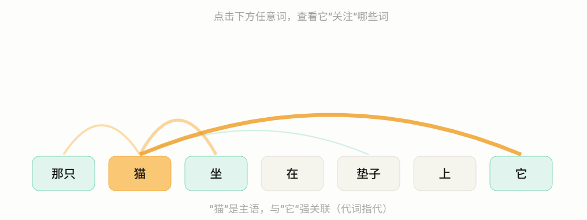
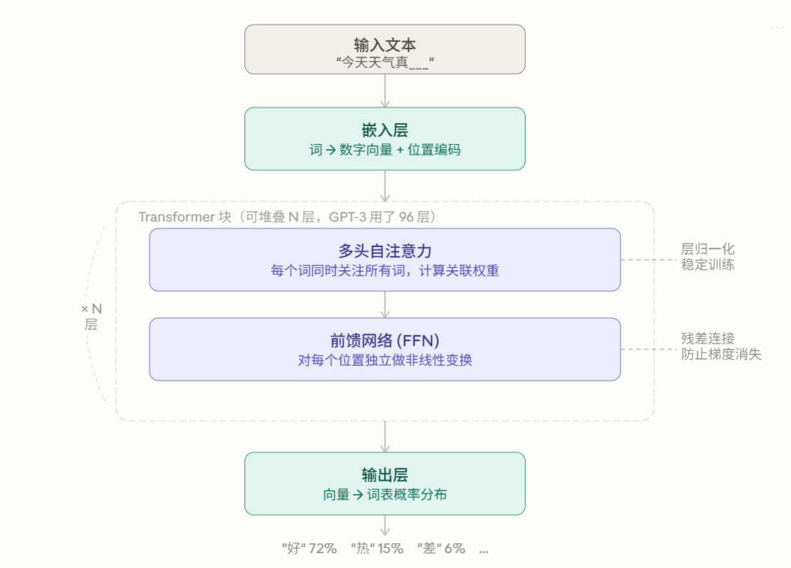

Transformer 是整本书的核心骨架。我们先建立直觉，再看结构。

### 从"顺序阅读"到"全局感知"的革命

在 Transformer 之前，AI 读句子像人读书——从左到右，一个词一个词地处理。这有个致命问题：

> "那只猫，在花园里玩耍了一整个下午，**它**很累了。"

读到"它"时，模型已经把"猫"这个词"记得很模糊"了，因为中间隔了太多词。Transformer 彻底改变了这一点——**它同时看整句话的每一个词，计算所有词之间的关联程度。**

这就是为什么它叫 **Attention**（注意力）——每个词都能"注意到"句子里的任意其他词。

下面这个互动图可以让你亲手感受注意力机制：

点击"它"这个词，观察它和"猫"之间出现的粗线——这就是注意力机制在工作：**模型发现"它"指代的是"猫"**。

---

### Transformer 的内部结构是什么样的？

Transformer 像一栋楼，把词语从底层一层一层地"加工"到顶层，每一层都让模型对词义的理解更深一步。

### Transformer 结构解读

图里从上到下是一句话被处理的完整旅程，分三段：

**第一段：嵌入层** — 把文字变成数字。计算机只认数字，所以每个词都被转换成一串数（比如 512 个数字组成的向量）。同时还加入"位置编码"，告诉模型这个词在句子的第几个位置。

**第二段：Transformer 块（核心）** — 这一块会重复 N 次（GPT-2 用 12 层，GPT-3 用 96 层）。每一层包含两个子步骤：

- 多头自注意力：让每个词"看"整句话，计算和其他词的关联程度。"多头"的意思是同时从多个角度去看（比如一个头关注语法关系，另一个头关注语义关系）
- 前馈网络：对每个词的表示做进一步加工，提炼更深层的含义

**第三段：输出层** — 把最终的向量映射到词表，算出下一个词是每个词的概率，取概率最高的那个输出。

---

### 为什么 Transformer 这么重要？

有三个关键优势让它统治了整个 AI 领域：

| 优势     | 含义                                                                |
| -------- | ------------------------------------------------------------------- |
| 并行计算 | 所有词同时处理，GPU 可以充分利用，训练速度快几十倍                  |
| 长程依赖 | "它"和句子开头的"猫"哪怕隔了 1000 个词，注意力也能直接连接它们      |
| 可扩展   | 堆更多层、用更多数据，模型能力几乎线性增长（这催生了 GPT-3、GPT-4） |

2017 年 Transformer 论文发出后，几乎所有之前的 NLP 模型都被淘汰了。GPT、BERT、T5、LLaMA……现在叫得出名字的大模型，底层全是 Transformer。

---

### 和本书的关系

第 3 章会一行行代码写出注意力机制，第 4 章把它们组装成完整的 GPT。现在不需要记住每个细节，只需要记住这个直觉：

> Transformer = 让每个词都能"看到"整句话，然后层层加工，最终预测下一个词
