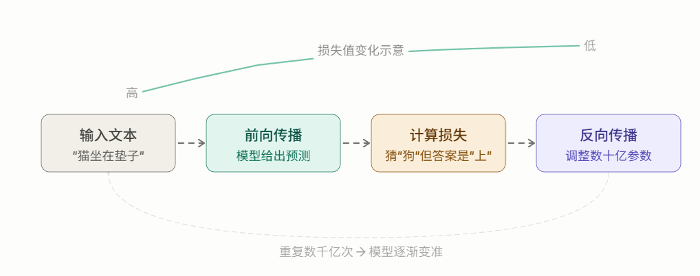

训练流程是理解"模型怎么变聪明"的关键。我们分两个阶段来讲。


### 第一阶段：预训练 — 让模型"读遍图书馆"

想象你把一个人关进图书馆三年，让他读遍所有书、网页、论文。他出来之后语言能力极强，但你没给他任何任务，他只会"续写文字"，不会主动回答问题。这就是预训练结束后的状态。

训练的核心机制只有一件事：**不断猜词、猜错了就调整参数**。

这四步循环是整本书里最核心的机制，我们挨个拆解：

**① 前向传播** — 把文本喂给模型，它给出预测。比如输入"猫坐在"，模型预测下一个词是"狗"（概率最高）。

**② 计算损失** — 把预测和正确答案对比，算出"错了多少"。正确答案是"垫"，但模型说"狗"，损失值就很大。

**③ 反向传播** — 这是最神奇的一步。PyTorch 自动计算：模型里哪些参数"对这次猜错负责"，以及每个参数应该调大还是调小。

**④ 更新参数** — 把所有参数微微调整一下。单次调整极小，但重复数千亿次，模型就越来越准。

---

### 第二阶段：微调 — 从"博览群书"到"听话助手"

预训练结束后的模型像一个博学但任性的人——你问他"北京在哪里"，他可能回答"北京在哪里？这是一道地理题……"，因为他只会**续写文字**，不会**回答问题**。

微调就是用"问题 → 回答"的配对数据，教会模型"听指令"的格式。


### 微调的两种方式

**监督指令微调（SFT）** 相对简单：准备几千到几万条"指令 → 回答"的配对，继续用预训练的方式训练。模型很快就能学会"看到问题要给出答案"这个格式，而不是漫无目的地续写文字。

**RLHF（基于人类反馈的强化学习）** 更精妙：让模型生成多个回答，由人类标注员排出优劣，再训练一个"奖励模型"来模仿人类的判断。最终用这个奖励模型持续引导主模型朝"人类觉得好"的方向优化。ChatGPT 能变得如此好用，RLHF 功不可没。

---

### 整个训练过程的规模感

这组数字能让你对训练的难度有个直觉：

|        | 预训练                         | 微调                       |
| ------ | ------------------------------ | -------------------------- |
| 数据量 | 数万亿个词（整个互联网）       | 数千到数万条对话           |
| 参数量 | GPT-2: 1.5 亿 / GPT-3: 1750 亿 | 同上（在原参数基础上微调） |
| 算力   | 数百到数千块 GPU，跑数周       | 几块 GPU，跑几小时到几天   |
| 费用   | GPT-3 预训练约 460 万美元      | 相对便宜得多               |

这也是为什么研究者更多做"微调"而不是"预训练"——从头训练一个大模型的成本实在太高。

---

### 和本书的关系

这本书的结构完全对应这两个阶段：

```
第2章 ~ 第5章  →  从零实现预训练（分词、模型结构、训练循环）
第6章          →  分类任务微调（最基础的微调形式）
第7章          →  指令微调（让模型学会对话）
```

你现在理解的这个训练流程，就是整本书的骨架。后面每章都是在这个框架里填一块拼图。
