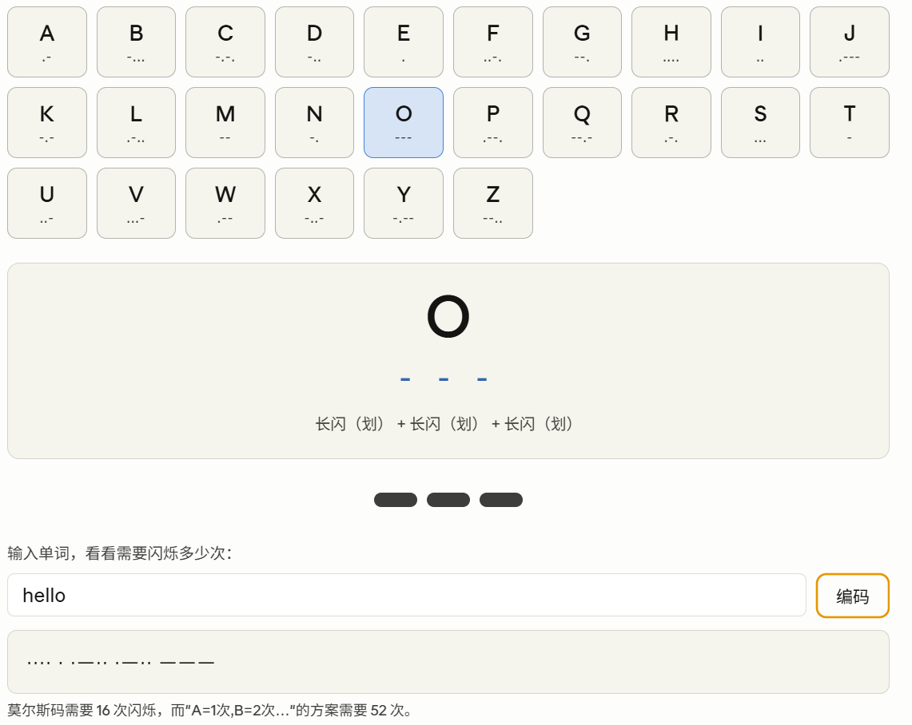

## 第一章：至亲密友

这一章的核心问题非常简单：**两个 10 岁的小孩，住在街对面，深夜想悄悄说话，怎么办？**

Petzold 用这个温馨的场景，引出了整本书最重要的概念——**编码（Code）**。

---

### 🔦 故事的起点：手电筒

父母说"关灯睡觉"，但你还想和对面的朋友聊天。手电筒是最好的选择——安静、定向、不会被家人发现。

**第一个想法**：用光在空气中"画字母"。O 就转一个圈，I 就竖着划一下——结果发现根本行不通，旋转的光线模糊不清。

**第二个想法**：用闪烁次数代表字母。A=闪 1 次，B=闪 2 次……Z=闪 26 次。这个方案有个致命缺陷：发送 "How are you?" 需要闪烁 **131 次**！而且遇到问号怎么办？

**第三个想法（书里的答案）**：跑去图书馆，发现了**莫尔斯电码（Morse Code）**！

---

### 📡 莫尔斯电码：第一个真正的"编码系统"

莫尔斯电码的天才之处在于只用**两种**信号——"点（·）"和"划（—）"——就能表达所有字母、数字和标点。

点击下面的字母，看看它的莫尔斯码是什么：

试着在输入框里打 `hello`，看看莫尔斯码需要多少次闪烁，对比"按字母顺序"方案节省了多少。

---

### 💡 这一章真正想说的是什么？

Petzold 借莫尔斯电码揭示了三个深刻的道理：

**1. 编码就是交流，不是秘密**
大多数编码的目的不是加密，而是**让信息能在不同介质之间传递**。声音 → 文字 → 手语 → 盲文 → 电信号……每一次转换都是一种编码。

**2. 只要有两种不同的状态，就能表达一切**
这是全书最核心的思想。点和划，亮和灭，0 和 1——问题的关键就在于数字**2**。"两个不同的事物，只要经过适当的组合，就可以表示所有类型的信息。"

**3. 好的编码不是随意的**
莫尔斯码里，最常用的字母 E 只需一个"点"，而罕见的 Q 和 Z 才有长编码。这是有意为之的设计——频率越高，编码越短，传输效率越高。（这正是后来"哈夫曼编码"的原理，贯穿整个计算机科学。）

---

### 🔗 承上启下

第一章结尾那句话非常精彩，是整本书的预告：

> "问题的关键就在于数字 2。两种闪烁，两种声音。事实上，两个不同的事物，只要经过适当的组合，就可以表示所有类型的信息，这的确是千真万确的。"

这一句话，就是二进制、就是计算机存储、就是一切的起点。后面每一章都在这个基础上往上叠加——第 2 章会深入探讨莫尔斯码背后的"组合"规律，第 3 章会引出布莱叶盲文和二进制的关系。
