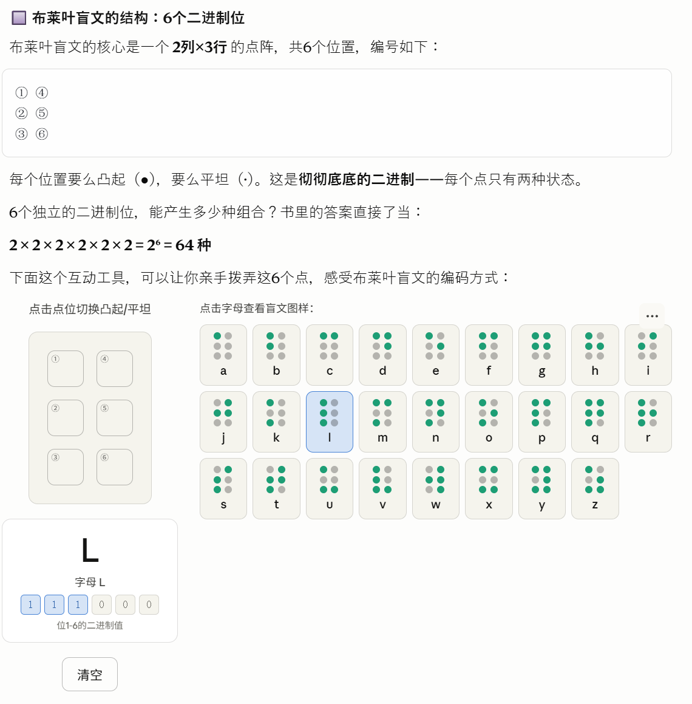

第三章完整读完了！这章内容非常精彩，来做深入讲解。

---

## 第三章：布莱叶盲文与二进制码

这一章表面上在讲盲文，实际上是整本书**迄今为止最接近计算机本质**的一章——它把二进制从"一个数学概念"变成了"一个真实存在、触手可及的系统"。

---

### 👦 路易斯·布莱叶的故事

1809 年，路易斯·布莱叶生于法国小镇，3 岁时在父亲的皮革工坊玩耍，被锥子刺伤一只眼睛，感染蔓延，双目失明。按当时的命运，他本应在贫困中度过一生，但他的智慧被老师发现，送入巴黎皇家盲人学校。

学校里有一种凸起字母的印刷系统——但太难用了，而且印书成本极高。布莱叶 12 岁接触到法国军官查尔斯·巴比尔发明的"**夜间书写**"系统（用凸点和划的组合在厚纸上传递战场信息），深受启发。他花 3 年改进，**15 岁**时就创立了自己的完整编码系统。

这个系统沿用至今，遍及全球。

---

### 🔲 布莱叶盲文的结构：6 个二进制位

布莱叶盲文的核心是一个 **2 列 ×3 行** 的点阵，共 6 个位置，编号如下：

```
① ④
② ⑤
③ ⑥
```

每个位置要么凸起（●），要么平坦（·）。这是**彻彻底底的二进制**——每个点只有两种状态。

6 个独立的二进制位，能产生多少种组合？书里的答案直接了当：

**2 × 2 × 2 × 2 × 2 × 2 = 2⁶ = 64 种**



---

### 💡 这章的三个核心洞见

**1. 6 个二进制位 = 64 种组合**

布莱叶盲文用 6 个点穷尽了 2⁶ = 64 种可能，刚好够用（26 个字母 + 数字 + 标点 + 特殊符号）。一个都没浪费——Petzold 专门验证了这一点，确认 64 个码字全部有意义。

**2. 换档码（Shift Codes）和逃逸码（Escape Codes）**

这是这章最精彩的部分。64 种码字不够怎么办？布莱叶盲文发明了两种机制：

- **换档码**：比如"数字标识符"出现后，接下来的码字全部从"字母模式"切换到"数字模式"。a→1，b→2……同一个码字，语境变了，含义就变了。这正是今天键盘上 **Shift 键** 和 **Caps Lock** 的鼻祖。

- **逃逸码**：比如大写标识符，只影响紧随其后的那一个字母。这正是今天计算机编程里 `\n`（换行）、`\t`（制表符）等 **转义字符** 的原型。

**3. 布莱叶盲文就是二进制码**

书里的最终结论非常直白：6 个点位，每个非凸即平，这就是 **6 位二进制数**。布莱叶在 1825 年，比第一台现代计算机早了一百多年，就已经在实践中完整地运用了二进制编码的全部思想。

---

### 🔗 承上启下

这三章合在一起，已经建立起了整本书的基石：

| 章      | 问题                              | 答案                  |
| ------- | --------------------------------- | --------------------- |
| 第 1 章 | 怎么用光传递信息？                | 编码 = 约定的符号系统 |
| 第 2 章 | 两种符号能表示多少种东西？        | 2ⁿ 种                 |
| 第 3 章 | 有没有真实存在的 6 位二进制系统？ | 有，布莱叶盲文就是    |

第 4 章开始就要"接地气"了——Petzold 会把手电筒拆开，带你进入电学世界，看看电是怎么工作的，为什么它天然适合表示二进制。
