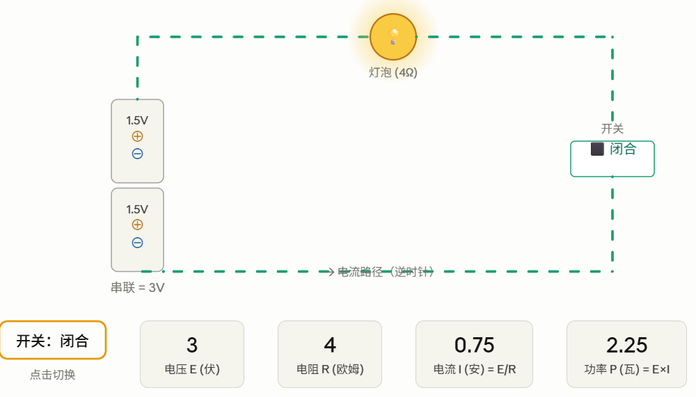
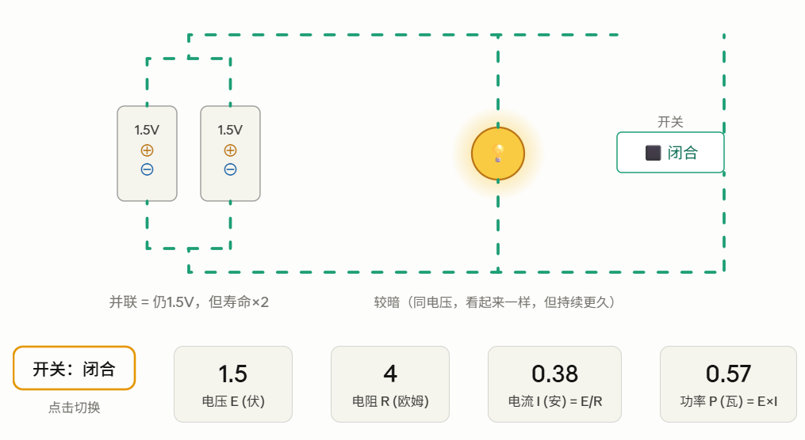
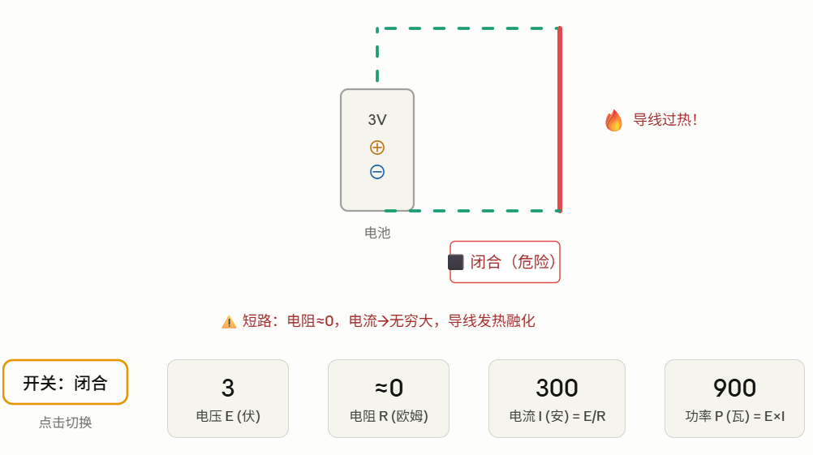

## 第四章：手电筒的剖析

这章的任务是：**把电学的基础知识讲清楚，恰好够理解计算机用**——不多也不少。

---

### ⚡ 电是什么？从原子说起

所有物质由**原子**构成，每个原子有三种粒子：

- **质子**（+）：在原子核中，带正电
- **中子**（中性）：在原子核中，不带电
- **电子**（-）：围绕原子核旋转，带负电

正常情况下质子和电子数量相等，原子是中性的。但电子有时会**从一个原子跑到另一个原子**——这就是电流的本质。

书里有个妙喻：用毛毯摩擦鞋底时，毛毯会把你鞋底的电子带走，你身上电子变少（带正电）；走到门把手时，你和门把手之间的电子瞬间"跳回"来平衡——这就是静电火花。闪电也是同样原理，只是规模大得多。

---

### 🔋 电路的四大要素

串联

并联

短路

---

### 📐 欧姆定律：电路的核心公式

书里介绍了三个基本概念和它们的关系：

**电压（E，伏特）**：推动电流的"势能"，就像水管中的水压。电池的化学反应把电子推向负极，造成正负极之间的"电位差"，即使不接电路也存在。

**电流（I，安培）**：每秒流过某点的电子数量。1 安培意味着每秒有 6,240,000,000,000,000,000 个电子通过！

**电阻（R，欧姆）**：阻碍电流的性质，越细越长的导线阻抗越大。

三者的关系就是著名的**欧姆定律**：

> **I = E / R**（电流 = 电压 ÷ 电阻）

书里的手电筒例子：两节 1.5V 电池串联 = 3V，灯泡电阻 4 欧姆：

**I = 3 ÷ 4 = 0.75 安培**，功率 **P = E × I = 3 × 0.75 = 2.25 瓦**

---

### 💡 串联 vs 并联

这章还比较了两种电池连接方式：

**串联**（两节首尾相接）：电压叠加，变成 3V → 灯更亮，但电池消耗更快。手电筒就是这样。

**并联**（两节正正相接、负负相接）：电压仍是 1.5V → 灯亮度不变，但电池寿命延长一倍。

**短路**：导线直接连通正负极，电阻几乎为零，电流 I = 3 / 0.001 → 近乎无穷大。导线会烧热融化，甚至起火。保险丝的作用就是在这时候先断掉自己，保护其他元件。

---

### 🔑 这章最重要的一句话

Petzold 在章末收尾时写道——

> 开关只能是闭合状态或断开状态。电流只能是有或者无。灯泡也只能是发光或不发光。就像莫尔斯和布莱叶发明的二进制码一样，这个简单的手电筒要么是开着的，要么是关着的。没有介于二者之间的状态。

这句话把前四章彻底串联起来了：**二进制编码（0 和 1）天然地映射到电路的两种状态（开和关）**——这就是为什么计算机要用电来做计算的根本原因。

---

### 🔗 承上启下

前四章完成了两件大事：前三章建立了"二进制编码"的思想，第四章建立了"电路的两种状态"。第五章开始就要把它们合并——当你朋友住在街对面时，如何用这些电线和灯泡搭建一条真正能传递莫尔斯码的通信线路？
