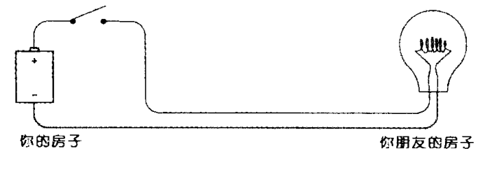
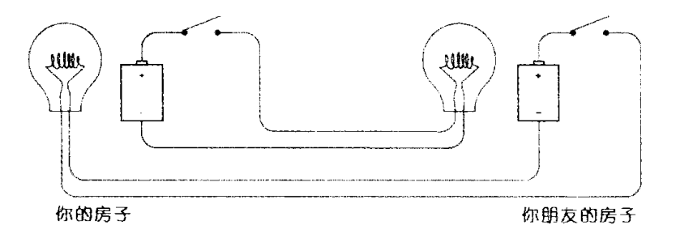
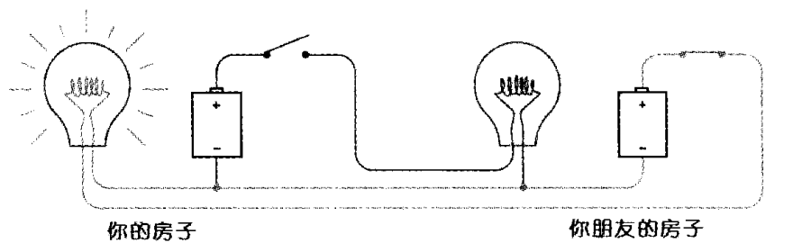
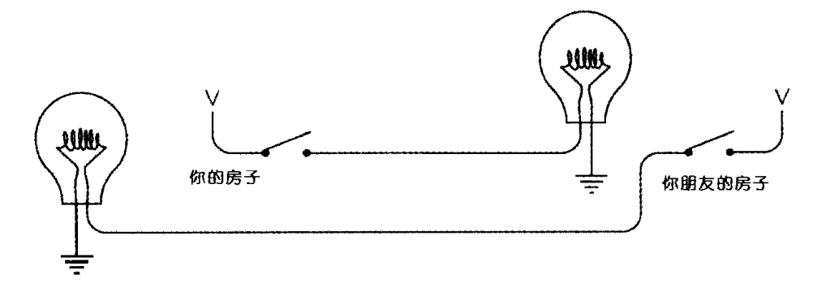

## 第五章：绕过拐角的通信

这章是全书前半部分的**实战应用**——把电学知识和二进制编码真正结合，搭出一套能跨越距离的通信系统。故事也升级了：你 12 岁的好友搬走了，你们需要跨越距离传递莫尔斯码。

---

### 🏠 从最朴素的想法开始

最直觉的方案：把第 4 章的手电筒电路拉长——用导线代替空气，开关在你这边，灯泡在朋友那边。两根导线穿过围墙，接好了。

这就是**单向电报系统**，而且完全可以工作。

但你们想双向通信，于是各装一套，共 4 根导线。再一想：两套电路的负极是相同的，可以合并——这就是**公用连接（Common）**，从 4 根线减到 3 根，省了 25%。

单向两根线

双向四根线

共用三根线

接地两根线

---

### 🌍 这章最精彩的发现：地球是导线

当线路要跨越很长距离时，省线路的需求变得迫切。第 3 根共用线能不能也省掉呢？

Petzold 给出了一个令人拍案叫绝的答案：**用地球代替它**。

地球是一个直径 7900 英里、由金属和岩石构成的巨大导体。导体截面越大，电阻越小——地球的截面积近乎无穷大，电阻近乎为零（只要电压够高）。只要在两端各打一根 8 英尺长的铜柱入地，地球就成了"第三根超级导线"。

这就是为什么电路图里有这个接地符号 ⏚——它代表的不是一根导线，而是整个地球。

---

### 📏 长距离的现实问题：导线电阻

这章还非常诚实地讨论了工程限制。铜是很好的导体，但不是完美的：导线越长，电阻越大。

书里用欧姆定律做了真实计算：

- 手电筒电池（3V），灯泡（4Ω），电流 = 3/4 = 0.75A，灯正常亮
- 用 20 号电话线延伸 1 英里，导线本身电阻超过 100Ω
- 新电流 = 3 / (4+100) ≈ **0.03A** → 灯根本无法点亮

解决方案有两个：用更粗的导线（贵），或**大幅提高电压**（用 100V 以上的系统）。这正是真实 19 世纪电报系统面临的问题，也引出了第六章的主角——**继电器**。

---

### 🔗 承上启下

第五章的最后一句话是全书最有预兆性的："这个难题的解决方案……尽管只不过是个很简陋的装置，但是正是基于这个装置，整个计算机系统才被构建出来。"

这个装置就是**继电器（Relay）**——第六章的主角。导线电阻会让信号越来越弱，继电器能在中途"接力"放大信号，让电报跨越千里。而继电器的工作原理，正是后来所有逻辑门和计算机硬件的直接祖先。
