## 第一章：Linux 是什么与如何学习

这一章回答三个核心问题：**Linux 从哪来？现在用在哪？以及怎么学好它？**

---

### 1.1 Linux 的历史：从 Unix 到 Linux

Linux 不是凭空出现的，它的诞生有一条清晰的历史脉络：

**几个关键人物记住就够了：**

Ken Thompson 写了 Unix 原型，Dennis Ritchie 用 C 语言重写让它可以到处移植。Stallman 发起 GNU 计划，提供了大量工具软件（gcc、bash 等），但就是没有核心。Linus 在 1991 年写出了那个核心，两者结合，才成就了今天完整的 GNU/Linux 系统。

---

### 1.2 什么是 Linux Distribution（发行版）

Linux 严格说只是**内核（Kernel）**，单独的内核没法直接用。各个社区和公司把内核加上 GNU 工具、图形界面、软件包管理器等打包在一起，就成了"发行版"。

书中把发行版分为两大家族，这个到今天依然适用：

| 家族       | 包管理          | 代表发行版           |
| ---------- | --------------- | -------------------- |
| Red Hat 系 | RPM / yum / dnf | RHEL、CentOS、Fedora |
| Debian 系  | dpkg / apt      | Debian、Ubuntu       |

本书基于 **CentOS 7**（Red Hat 系），学会后切换到 Ubuntu 也很快。

---

### 1.3 Linux 现在用在哪？

鸟哥总结了三类主要用途：

**① 网络服务器**——这是 Linux 最强的领域。Web 服务器（Apache/Nginx）、邮件服务器、数据库服务器，全球大多数服务器跑的都是 Linux。

**② 关键任务系统**——金融机构的数据库、交易系统，稳定性要求极高，Linux 的高稳定性在这里发光。

**③ 学术/高性能运算**——超级计算机 Top500 里，几乎清一色是 Linux。科学计算、AI 训练集群，都在跑 Linux。

---

### 1.4 最重要：如何学好 Linux？

这是鸟哥在第一章最核心的建议，也是很多人学 Linux 失败的原因。

> **用手去打命令，不要只用眼睛看。**

鸟哥的原话是：学习 Linux 跟学骑单车一样，看一百篇文章，不如自己摔一次然后爬起来再骑。

几条具体建议：

**1. 必须有一个练习环境。** 不需要专门买机器，用虚拟机（VMware/VirtualBox）或者 WSL（Windows 上的 Linux 子系统）就够了。

**2. 遇到不懂的命令，先查 `man`。** Linux 自带的 man 手册页是最权威的文档，第四章我们会重点学这个。

**3. 出错是正常的。** 看懂报错信息，是 Linux 学习里最重要的能力之一。

**4. 不必全部记住命令。** 重要的是知道去哪里查，理解逻辑比死记硬背重要得多。

---

### 本章重点回顾

| 概念       | 要点                                   |
| ---------- | -------------------------------------- |
| Linux 内核 | Linus 1991 年发布，遵循 GPL 授权       |
| GNU/Linux  | GNU 工具 + Linux 内核 = 完整系统       |
| 发行版     | RPM 系 vs Debian 系，本书用 CentOS 7   |
| GPL 协议   | 使用可以商业化，但修改后必须公开源代码 |
