## 第零章精华版：你需要懂的那些事

全章浓缩成 **4 个核心概念**，每个都跟后面的 Linux 学习直接挂钩。

---

### 概念一：CPU、内存、硬盘的关系

很多人用了多年电脑，其实没真正理解这三者的关系。鸟哥用了一个很好的比喻：

**这个概念跟 Linux 的关系：** 后面学到的 `swap`（交换空间）就是用硬盘模拟内存，以及为什么服务器内存要大，都源于这个原理。

---

### 概念二：容量单位——别被搞混

Linux 里随时要看文件大小、磁盘容量，单位必须搞清楚：

| 单位             | 大小             | 常见场景         |
| ---------------- | ---------------- | ---------------- |
| **bit（位）**    | 最小单位，0 或 1 | 网速单位（Mbps） |
| **Byte（字节）** | 8 bits           | 文件大小基本单位 |
| **KB**           | 1024 Bytes       | 小文件           |
| **MB**           | 1024 KB          | 图片、文档       |
| **GB**           | 1024 MB          | 硬盘、内存       |

一个常见陷阱：**网速的 100Mbps 和下载速度的 MB/s 不一样。** 100Mbps ÷ 8 = 约 12.5 MB/s，这就是为什么你买了"百兆宽带"，下载速度只有约 12MB/s，不是被骗了。

---

### 概念三：编码——乱码问题的根源

这个概念在 Linux 里非常实用，因为你一定会遇到乱码。

电脑只认识 0 和 1，所有文字都是数字编码后存储的。不同编码系统的"数字 ↔ 文字"对照表不同，用错了就出现乱码。

**三种编码你需要知道：**

- **ASCII**：只支持英文和符号，每个字符占 1 Byte
- **Big5**：繁体中文编码，每个汉字占 2 Bytes（台湾早期常用）
- **UTF-8**：万国码，支持全球所有语言，现在的主流标准

**跟 Linux 的关系：** 在 Linux 终端里，如果你看到乱码，第一件事就是检查编码设置。后面学到 `LANG` 这个环境变量，以及文件编码转换命令 `iconv`，都基于这个概念。

---

### 概念四：操作系统是什么——最重要的概念

这是整本书的基础，必须真正理解。

几个关键结论，后面会反复用到：

**① Linux 本质上只是内核**，它负责管理所有硬件。我们平时说的"Linux 系统"，其实是内核 + 一大堆应用程序的组合（即发行版）。

**② 内核常驻内存，且受保护。** 你不能直接操作内核，只能通过应用程序间接使用。这也是为什么普通用户权限有限，`root` 才是真正的管理员。

**③ 驱动程序是硬件厂商的责任。** 如果某个硬件在 Linux 下用不了，通常是因为厂商没有提供 Linux 驱动。这在后面安装系统时可能会遇到。

**④ 应用程序依赖操作系统。** Windows 的软件不能直接在 Linux 上跑，就是因为它们调用的是 Windows 的系统接口，不兼容。

---

### 本章总结：记住这 4 件事

1. **CPU 只能处理内存里的数据**，硬盘的内容要先载入内存才能被使用
2. **网速用 bit，文件大小用 Byte**，1 Byte = 8 bits
3. **乱码 = 编码不匹配**，Linux 现在主流用 UTF-8
4. **Linux = 内核 + 系统调用接口**，用户通过应用程序（比如 bash）间接操作硬件
