## 第二章精华：磁盘规划-选读

这章的核心就一件事：**把一块硬盘切成几个区域，分别用于不同用途。** 就像买了一套房，要规划哪个房间住人、哪个放杂物。

---

## 第三章核心：磁盘分区规划

这章最重要的三个问题：**磁盘怎么命名？怎么切分区？Linux 装系统时该怎么规划？**

---

### 一、Linux 里磁盘叫什么名字

在 Windows 里磁盘叫 C 盘、D 盘，在 Linux 里磁盘是**文件**，放在 `/dev/` 目录下：

| 接口类型   | 设备文件名     | 例子                                   |
| ---------- | -------------- | -------------------------------------- |
| SATA / USB | `/dev/sd[a-z]` | 第 1 块 `/dev/sda`，第 2 块 `/dev/sdb` |
| 虚拟机磁盘 | `/dev/vd[a-z]` | `/dev/vda`                             |

**分区的命名**是在磁盘名后面加数字：

```
/dev/sda     ← 整块磁盘
/dev/sda1    ← 第一块磁盘的第1个分区
/dev/sda2    ← 第一块磁盘的第2个分区
```

---

### 二、分区表：MBR vs GPT

切分区之前，磁盘要先有一张"地图"记录怎么切的，这张地图叫**分区表**。有两种格式：

**记住 MBR 的一个坑：** 逻辑分区的编号从 5 开始，1-4 保留给主分区/延伸分区。所以你在 Linux 里看到 `/dev/sda5` 不要奇怪，这不代表有 5 个分区，只是第一个逻辑分区的编号就是 5。

---

### 三、安装 Linux 时必须有哪些分区

这是本章最实用的部分。安装 Linux 时至少要规划这几个分区：

**实际案例：** 如果你有一块 500GB 的硬盘要装 Linux，鸟哥推荐的规划是：

| 分区    | 大小     | 说明                      |
| ------- | -------- | ------------------------- |
| `/boot` | 1 GB     | 开机核心文件              |
| `swap`  | 4~8 GB   | 看内存大小，一般 2 倍内存 |
| `/`     | 100 GB   | 系统主分区                |
| `/home` | 剩余所有 | 个人数据                  |

---

### 四、为什么要分这么多区？

举个具体例子你就懂了：

假设你只有一个 `/` 分区，有一天系统日志文件（log）太大把磁盘写满了，**整个系统就崩了**，因为连 `/home` 下你的个人文件也没法写入。

但如果 `/home` 是独立分区，日志把 `/` 写满了，最多系统运行异常，你的个人数据还在 `/home` 里安然无恙。**分区隔离风险**，这是核心思想。

---

### 第二章总结：记住这 4 件事

1. Linux 磁盘文件名是 `/dev/sda`，分区是 `/dev/sda1`、`/dev/sda2`……
2. MBR 最多 4 个主分区，逻辑分区从编号 5 开始；GPT 最多 128 个，无此限制
3. 安装 Linux 必须有 `/boot` 和 `/`，强烈建议加 `swap`
4. 独立分区的目的是**隔离风险**，某个分区出问题不影响其他分区

---

---

---

---

---

---

---

---

---

---

---

---

---

---

---

WSL 2 是最适合你的，理由很简单：

- 直接在 Windows 里用，不需要重启切换
- 5 分钟装好，没有复杂配置
- 对于学习鸟哥这本书的所有命令，完全够用

## 第三章：WSL 安装步骤

### 第一步：开启 WSL 功能

以**管理员身份**打开 PowerShell（在开始菜单搜索 PowerShell，右键选"以管理员身份运行"），然后输入：

```powershell
wsl --install
```

回车，等它跑完。它会自动帮你安装 WSL 2 和 Ubuntu。

> 如果提示"需要重启"，重启电脑后继续。

---

### 第二步：重启后完成设置

重启后 Ubuntu 会自动弹出一个黑窗口，提示你设置用户名和密码：

```
Enter new UNIX username: 你想要的用户名（小写字母）
New password: 设一个密码（输入时屏幕不显示，这是正常的）
Retype new password: 再输一遍
```

**记住这个密码**，后面用 `sudo` 命令时会要求输入。

---

### 第三步：验证安装成功

在 Ubuntu 窗口里输入：

```bash
uname -a
```

如果看到一行包含 `Linux` 字样的输出，说明成功了。

---

### 以后怎么打开？

两种方式都行：

- 开始菜单搜索 **Ubuntu**，点击打开
- 或者安装 **Windows Terminal**（微软商店搜索即可），体验更好，可以同时开多个标签页

---

### 装完之后

先更新一下系统，在 Ubuntu 窗口里输入：

```bash
sudo apt update && sudo apt upgrade -y
```

第一次会要求输入密码，输入你刚才设的那个。

---

现在你理解了为什么 Linux 要装在这些分区里，后面第七章学磁盘管理时会更轻松。
